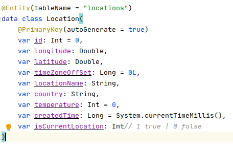
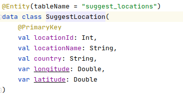
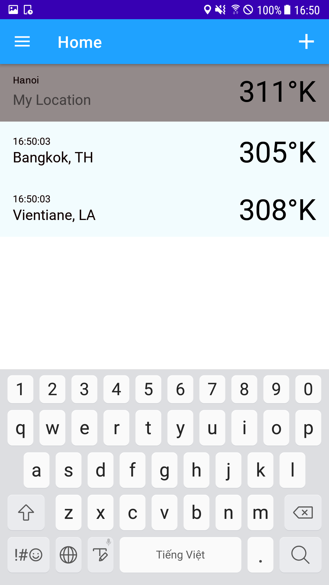
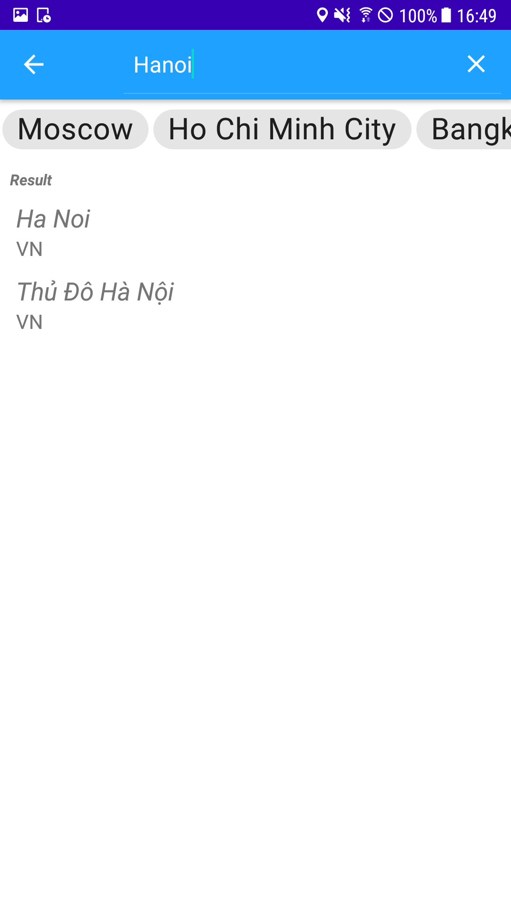
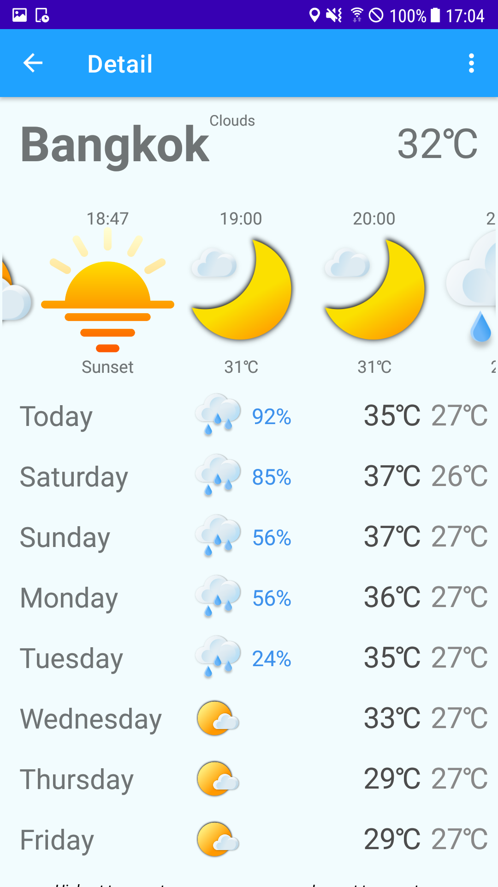
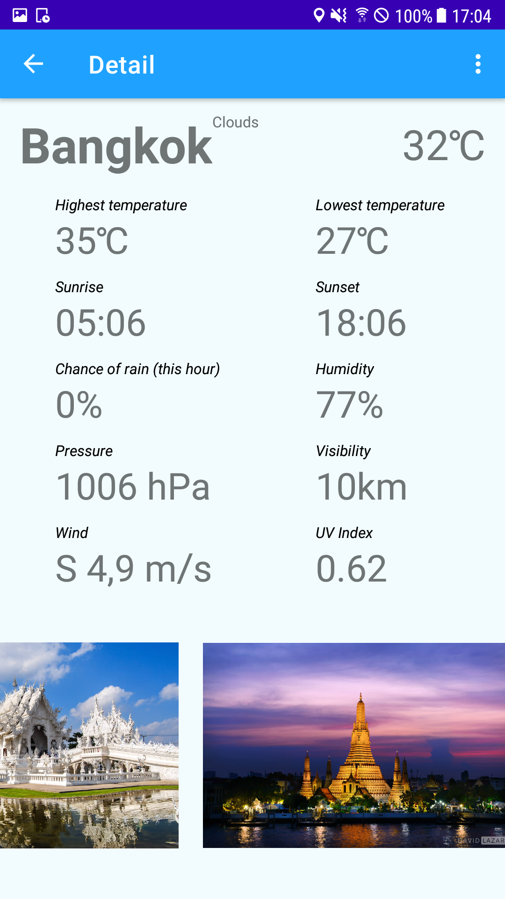
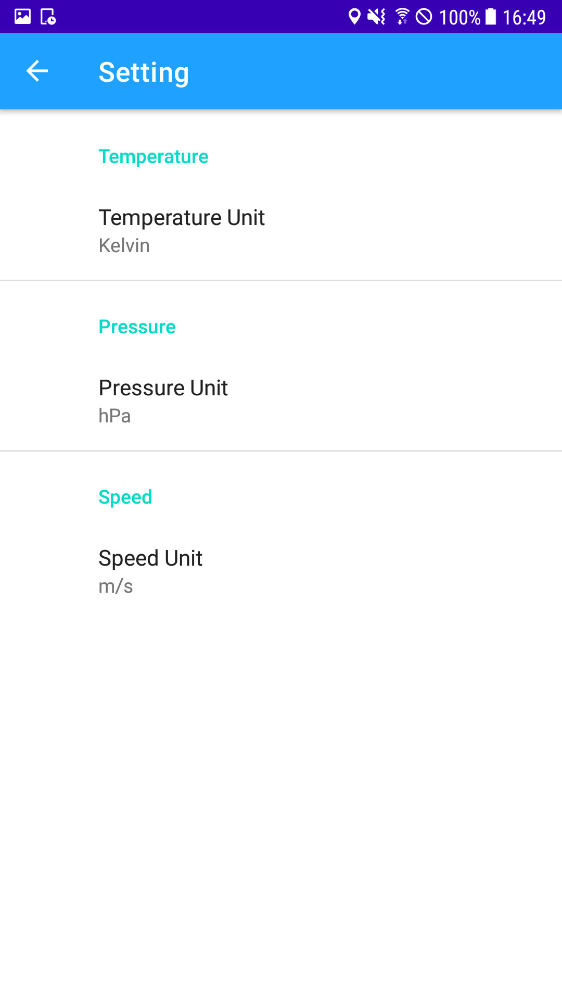
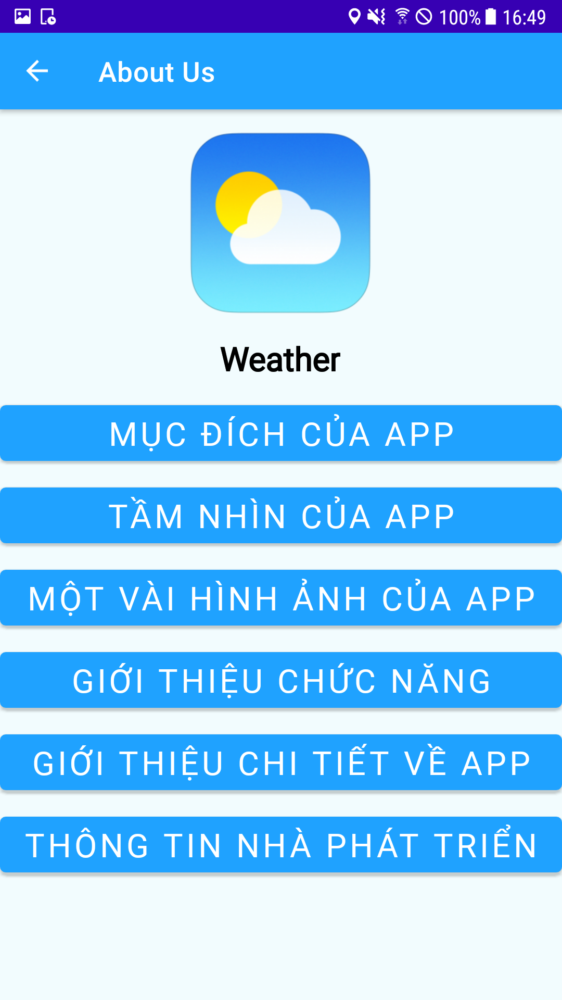
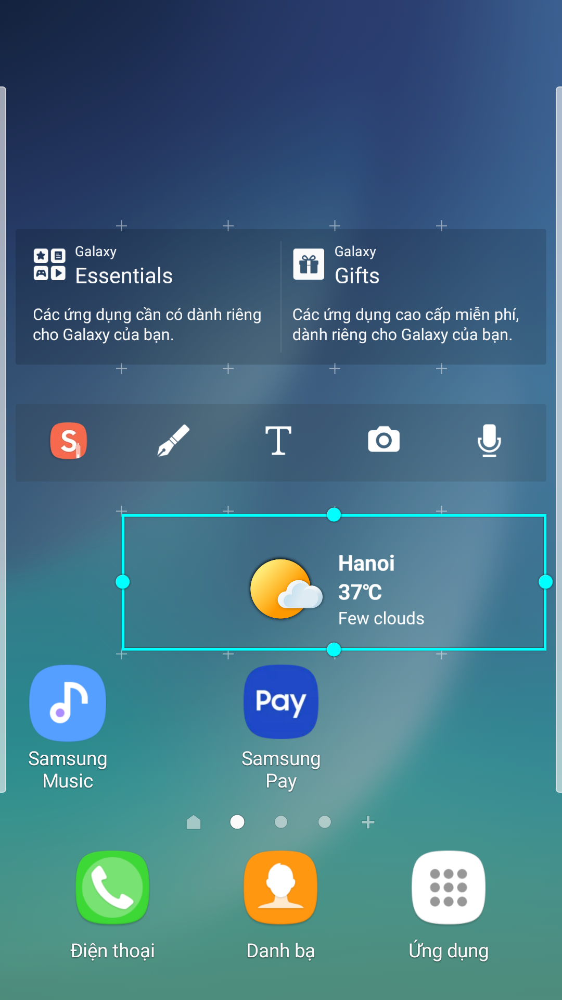

# _[Weather](https://github.com/inFngNam/Weather)_
---
## Mô tả
Ứng dụng cung cấp thông tin thời tiết cho các loại điện thoại thông minh dùng hệ điểu hành android

_Project cuối kỳ môn phát triển ứng dụng di động_

## Công nghệ sử  dụng

Ngôn ngữ lập trình: **Kotlin**

Kiến trúc sử dụng: **Client-Server**, **MVVM**

Một số thư viện sử dụng
- _Database_: **Room**, **SQLITE**
- _HTTP Request Helper_: **Retrofit2**, **Picasso**
- _JSON Convert_: **Moshi**
- _Design, layout, navigation_: **Card View**, **Recycler View**, **Navigation Fragment**, **Material**,
- _Log_: **Timber**
- _Một số thư viện mở rộng_: **Coroutines Support**, **JUNIT**, **Room test tool**, **Androidx Test Run**

Api
- [OpenWeatherMap](https://openweathermap.org)
- [GoogleSearchEngine](https://cloud.google.com/compute)

Cấu trúc dữ liệu

_**Location**_

_**SuggestLocation**_  (bảng tạo ra dùng để test migration)

## Một số tính năng
- Yêu cầu vị trí hiện tại người dùng => Lấy thông tin thời tiết tại vị trí của người dùng
- Đổi đơn vị hiển thị nhiệt độ, vận tốc, áp suất

- Tìm kiếm một địa điểm dựa theo tên + hỗ trợ một số điểm gợi ý trước

- Lấy thông tin thời tiết tại một vị trí dựa theo kinh độ, vĩ độ

- Xem thông tin chi tiết về 1 địa điểm

  - Thông tin 24 giờ tiếp theo

  - Thông tin 7 ngày tiếp theo

  - Thông tin chi tiết thời tiết hiện tại: Nhiệt độ, hướng gió, vận tốc gió, độ ẩm, thời gian mặt trời lặn, mọc, ...

  - Một vài hình ảnh giới thiệu về địa điểm đó qua api

- Theo dõi/Hủy theo dõi một địa điểm

- Share thông tin thời tiết dưới dạng văn bản

- Hộ trợ widget tại màn hình chính của người dùng

## Một số hình ảnh của ứng dụng

### Màn hình home

### Màn hình Find Location

### Màn hình Detail

### Màn hình Settings

### Màn hình about us

### Widget

## Thành viên trong nhóm 24
1. [Nguyễn Văn Nam](https://github.com/inFngNam)
2. [Vương Thành Toàn](https://github.com/toan01-uet)
3. [Trịnh Thị Thư](https://github.com/thu21)

## Báo cáo
[Báo cáo chi tiết]()
[Kiểm tra đạo văn]()